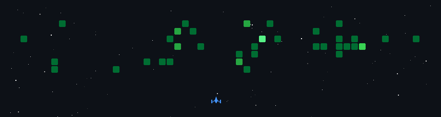

# Hi there, I'm Sanchez 👋

**AI-Powered Full-Stack Developer | Automation & Passive Income Enthusiast 🤖**

I'm a full-stack developer who treats AI not just as a tool, but as a dedicated 'pair programmer.' I am deeply passionate about automating systems with code and creating tangible value. I absolutely love diving into discussions about new technologies, sharing ideas, and talking about code. Feel free to drop a message anytime! ☕️

### 🛠️ What I do
- **Full-Stack Development:** I design and implement end-to-end architectures—from the frontend to the backend—using React, NestJS, and GraphQL.
- **Desktop & Beyond:** I enjoy building fast, cross-platform desktop applications utilizing the Tauri framework.
- **Infrastructure & Automation:** I build and manage my own server infrastructure using Proxmox and Docker. If a task requires manual repetition, I will script and automate it.
- **Algorithmic Trading:** I build automated trading bots for cryptocurrencies and US stocks using Python and libraries like `ccxt`, actively experimenting with system-driven passive income pipelines.

### 💬 Let's Talk About
I'm always down to chat about:
- Efficient system architecture design and code refactoring.
- Boosting developer productivity by 200% using AI tools.
- Algorithmic trading strategies and building post-income pipelines.
- The journey from planning to deployment for projects like Orvits or Baekdu FTA.

### 💻 Tech Stack
* **Frontend:**  
* **Backend:**  
* **Infra & Desktop:**   
* **Automation:** 

---
*P.S. The first round of all my code reviews is handled by my lead reviewer: my cat, Hobbang. 🐾*

---
# Experience

## Hermes Solution. Research Engineer.
2025.05.08 ~ 

### 👾 GitHub Space Shooter

